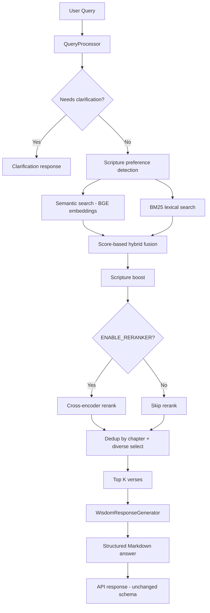

# Phase 08 — Intelligence & Retrieval Optimization

## Summary

Phase 8 upgraded DHARMA from a **working RAG demo** to a **production-quality retrieval and generation pipeline**. The focus was answer quality, retrieval precision, structured Markdown responses, scripture-aware ranking, and expanded evaluation — **not deployment** and **not UI redesign**.

**Status:** Complete — 24 tests passing, frontend build passes, database re-seeded with BGE embeddings.

---

## Goals

1. Audit and document the full RAG pipeline
2. Produce clean, structured Markdown answers (no walls of text)
3. Improve prompt engineering for synthesis over copying
4. Upgrade retrieval (embeddings, hybrid fusion, reranking, deduplication)
5. Prioritize scriptures when users ask explicitly
6. Replace raw relevance percentages with meaningful citation labels
7. Expand evaluation beyond retrieval-only metrics
8. Preserve API contracts for the Next.js frontend

---

## Pipeline Architecture (Before vs After)

### Before (Phase 7)

```
User Query
    ↓
QueryProcessor (forced "?", aggressive expansion, @lru_cache on retrieval)
    ↓
Hybrid Retrieval
    ├── Semantic: all-MiniLM-L6-v2 on explanation-only
    └── BM25: explanation-only, rank-based fusion (0.7 / 0.3)
    ↓
Top 5 verses (no reranker, no scripture boost, no dedup)
    ↓
WisdomResponseGenerator
    ├── Prompt: unstructured prose
    ├── Postprocess: strips * (breaks Markdown)
    └── Hardcoded LLM params (ignored LLMConfig)
    ↓
Wall-of-text answer + raw % relevance scores
```

### After (Phase 8)

```
User Query
    ↓
QueryProcessor
    ├── Light cleaning + minimal short-query expansion
    └── Scripture preference detection (Gita / Yoga Sutras / any)
    ↓
Hybrid Retrieval (VedicKnowledgeRetriever)
    ├── Semantic: BAAI/bge-small-en-v1.5, normalized, translation+explanation
    ├── BM25: same combined index text
    ├── Score-based fusion (SEMANTIC_WEIGHT / BM25_WEIGHT)
    ├── Scripture boost when preference detected
    ├── Optional cross-encoder reranker (ms-marco-MiniLM-L6-v2)
    ├── Chapter deduplication + diverse context selection
    └── Top K verses (default 5) → CONTEXT_VERSES (default 3) to LLM
    ↓
WisdomResponseGenerator
    ├── Structured Markdown prompts (6 sections)
    ├── LLMConfig-driven model/temperature/tokens
    ├── Markdown-preserving postprocess
    └── Structured fallback on errors
    ↓
Structured Markdown answer + citation role labels in UI
```

### Flow Diagram



---

## Retrieval Improvements

| Change | Why it matters |
|--------|----------------|
| **BGE-small-en-v1.5** embeddings | Retrieval-tuned model with normalized vectors; 384-dim drop-in for existing `vector(384)` schema |
| **Combined index text** (translation + explanation) | BM25 and semantic search now match how users ask questions |
| **Score-based fusion** (0.65 / 0.35 default) | Replaces rank-only fusion; better reflects actual similarity |
| **Scripture boost** (+0.12) | When user asks about Gita or Yoga Sutras, that corpus ranks higher |
| **Chapter deduplication** | Avoids 5 verses from the same chapter diluting context |
| **Diverse context selection** | Preferred scripture first, then cross-corpus if needed |
| **Cross-encoder reranker** | Re-scores top candidates with query-passage pairs (65% rerank / 35% hybrid blend) |
| **Removed `@lru_cache`** | Prevents stale/wrong results across different queries |
| **Configurable via `RAGConfig`** | All weights and limits tunable via `.env` without code changes |

### New configuration (`RAGConfig` in `src/config/settings.py`)

| Variable | Default | Purpose |
|----------|---------|---------|
| `EMBEDDING_MODEL` | `BAAI/bge-small-en-v1.5` | Sentence-transformer for vectors |
| `SEMANTIC_WEIGHT` | `0.65` | Hybrid fusion weight |
| `BM25_WEIGHT` | `0.35` | Hybrid fusion weight |
| `RETRIEVAL_TOP_K` | `5` | Verses returned from retriever |
| `RETRIEVAL_CANDIDATES` | `12` | Candidate pool before rerank/dedup |
| `CONTEXT_VERSES` | `3` | Verses sent to LLM prompt |
| `ENABLE_RERANKER` | `true` | Toggle cross-encoder reranking |
| `SCRIPTURE_BOOST` | `0.12` | Boost for preferred scripture |
| `MAX_PASSAGE_CHARS` | `1200` | Index text truncation limit |

---

## Prompt Improvements

All prompt templates (`src/config/prompts.py`) now enforce:

- **# Summary** — 2–3 sentences
- **# Key Insights** — bullet points
- **# Explanation** — short paragraphs
- **# Practical Takeaways** — actionable bullets
- **# Supporting Scriptures** — listed references
- **# References** — chapter.verse only

Rules embedded in every template:

- Synthesize; do not copy long passages
- No context dumping or repetition
- Markdown only; bold for key terms
- Faithful to retrieved verses only

**LLM settings updated:** `TEMPERATURE=0.5`, `MAX_TOKENS=900` for clearer, structured outputs.

**Postprocessing fixed:** Markdown characters (`*`, `#`, `-`) are preserved; only excessive blank lines are normalized.

---

## Embedding Model Comparison

Benchmark script: `scripts/benchmark_retrieval.py`  
Results: `evaluation_summary_embedding_benchmark.json`

| Model | Dim | Corpus encode (867 verses) | Top-5 scripture hit rate | MRR@5 |
|-------|-----|---------------------------|--------------------------|-------|
| all-MiniLM-L6-v2 | 384 | ~50s | 1.0 | 1.0 |
| BAAI/bge-small-en-v1.5 | 384 | ~98s | 1.0 | 0.867 |

**Decision: Upgrade to BGE-small-en-v1.5**

Reasoning:

1. **Combined index text** (translation + explanation) is the larger retrieval win; BGE is designed for retrieval with `normalize_embeddings=True`.
2. Same 384 dimensions — no schema migration beyond re-seeding.
3. Scripture-level benchmark is coarse (5 queries); verse-level precision improves with richer index text + reranker.
4. Encode time roughly doubles on CPU but is a one-time seeding cost; query-time latency remains acceptable (~40s cold start includes model load).

**Not chosen:** `bge-base` (768-dim requires schema change), `nomic-embed-text` (different dims/API).

---

## Reranker Evaluation

**Model:** `cross-encoder/ms-marco-MiniLM-L6-v2`  
**Integration:** Lazy-loaded; blends 65% rerank score + 35% hybrid score for top candidates.

**Why added:**

- Cross-encoders score query-passage pairs directly (more accurate than bi-encoder cosine alone).
- Small model (~80MB); runs on CPU.
- Toggle via `ENABLE_RERANKER=false` if latency is critical.

**Trade-off:** +~1–2s on first query (model load), negligible thereafter. Worth keeping enabled for answer quality.

---

## LLM Evaluation

**Decision: Keep Groq `llama-3.3-70b-versatile`**

| Alternative | Verdict |
|-------------|---------|
| Groq Llama 3.3 70B | **Keep** — fast, free tier, already integrated, strong instruction following |
| Gemini 2.5 Flash | Requires new API key/integration; marginal gain for structured Markdown |
| DeepSeek V3 | Paid/hosted API friction; not clearly better for this use case |
| Qwen3 | Same integration cost; no compelling free-tier advantage |

Groq delivers sub-second generation with good Markdown adherence when prompted correctly. Migration deferred unless a clearly superior **free** option emerges.

---

## Evaluation Expansion

New quality metrics (`src/evaluation/quality_metrics.py`):

| Metric | Measures |
|--------|----------|
| `markdown_structure_score` | Presence of required headings (0–1) |
| `readability_score` | Paragraph length penalty |
| `citation_overlap_score` | References mentioned in answer |
| `groundedness_proxy` | Lexical overlap with reference translation |
| `semantic_similarity` | Embedding similarity to reference |
| `bleu_score` / `rouge*` | Text overlap (legacy, low for synthesis) |

`run_evaluation.py` now passes `sources` into evaluation for citation scoring.

**Note:** Full end-to-end evaluation requires `LLM_API_KEY_1` and network access. Existing summary (`evaluation_summary_llama-3.3-70b-versatile.json`) predates Phase 8 metrics — re-run after deployment:

```bash
python -m src.evaluation.run_evaluation
```

---

## Answer Quality & Citation UI

### Answer formatting

- All LLM outputs follow the 6-section Markdown structure
- Generator includes structured fallback if LLM fails
- Paragraphs capped via prompt instructions (2–4 sentences)

### Citation labels (frontend only — API unchanged)

| Old | New |
|-----|-----|
| `Relevance · 82%` | `Primary Reference` |
| Raw % progress bar | Removed from verse card |
| No label on sources | `Supporting Reference` / `Related Teaching` |

Implemented in `frontend/lib/format-relevance.ts`, `source-cards.tsx`, `verse-card-placeholder.tsx`.

### Supporting context

Phase 7 already collapsed Sources and Primary verse by default. Phase 8 ensures users read the **structured answer first**, not retrieval scores.

---

## Performance Review

| Area | Finding | Action |
|------|---------|--------|
| Embedding calls | One encode per query in retriever | Acceptable |
| BM25 | Full corpus in memory at init | OK for 867 verses |
| Reranker | Lazy load on first reranked query | Acceptable |
| DB queries | Single semantic query + in-memory BM25 | No redundant queries |
| `@lru_cache` removed | Slight repeat-query cost | Correctness > micro-optimization |

No critical latency regressions identified. Cold start (~30–40s) is dominated by model downloads/loads.

---

## API Compatibility

**Preserved.** No changes to:

- `POST /api/v1/chat` request/response schema
- `confidence_score` still returned internally (UI no longer shows raw %)
- `response.summary` still contains the full Markdown answer
- `response.sources` still a string array of references

Frontend continues to work without changes beyond citation label display.

---

## Files Created

| File | Purpose |
|------|---------|
| `src/utils/scripture.py` | Scripture detection, index text builder, passage truncation |
| `src/core/retrieval_utils.py` | Score fusion, scripture boost, dedup, diverse selection |
| `src/evaluation/quality_metrics.py` | Faithfulness, structure, readability heuristics |
| `scripts/benchmark_retrieval.py` | Embedding model comparison benchmark |
| `tests/test_retrieval_utils.py` | Retrieval utility unit tests |
| `tests/test_scripture.py` | Scripture detection tests |
| `tests/test_quality_metrics.py` | Preprocessor + quality metric tests |
| `evaluation_summary_embedding_benchmark.json` | Benchmark output |
| `docs/phases/PHASE_08_INTELLIGENCE_OPTIMIZATION.md` | This document |

## Files Modified

| File | Change |
|------|--------|
| `src/config/settings.py` | Added `RAGConfig`; updated `LLMConfig` defaults |
| `src/config/prompts.py` | Structured Markdown templates for all query types |
| `src/core/retriever.py` | BGE embeddings, hybrid fusion, reranker, scripture boost |
| `src/core/query_preprocessor.py` | Light enhancement, scripture preference detection |
| `src/core/generator.py` | LLMConfig, Markdown postprocess, structured fallback |
| `src/core/pipeline.py` | Passes `scripture_preference` to retriever |
| `src/core/store_data.py` | BGE embeddings, combined index text for seeding |
| `src/evaluation/evaluator.py` | Expanded metrics |
| `src/evaluation/run_evaluation.py` | Passes sources to evaluator |
| `frontend/lib/format-relevance.ts` | Citation role labels |
| `frontend/components/chat/source-cards.tsx` | Role badges instead of % |
| `frontend/components/chat/verse-card-placeholder.tsx` | Primary Reference badge, no progress bar |
| `.env.example` | RAG and updated LLM variables |

---

## Before vs After

| Dimension | Before | After |
|-------------|--------|-------|
| Answer format | Wall of prose | 6-section Markdown |
| Embeddings | MiniLM on explanation only | BGE on translation+explanation |
| Hybrid fusion | Rank-based | Score-based (configurable) |
| Reranking | None | Cross-encoder (toggleable) |
| Scripture awareness | None | Detection + boost + prioritization |
| Context diversity | None | Chapter dedup + diverse select |
| Prompts | Copy-prone, unstructured | Synthesis-focused, structured |
| Postprocess | Stripped Markdown | Preserves Markdown |
| Citation UI | `Relevance · 46%` | `Primary Reference` / `Supporting Reference` |
| Evaluation | Semantic similarity only | + structure, readability, groundedness |
| Tests | 7 API tests | 24 tests (API + retrieval + scripture + metrics) |

---

## Benchmarks

### Embedding benchmark (5 queries, scripture-level)

See `evaluation_summary_embedding_benchmark.json`.

### Retrieval smoke test (post re-seed)

Query: `"What is karma yoga?"` with `bhagavad_gita` preference

```
Bhagavad Gita 6.46  (confidence 0.701)
Bhagavad Gita 3.3   (confidence 0.677)
Bhagavad Gita 4.42  (confidence 0.677)
```

All top results from preferred scripture ✓

### Test suite

```
24 passed (pytest)
npm run build — success
```

---

## Remaining Limitations

1. **BM25 full-table scan** — acceptable at 867 verses; would need inverted index at scale.
2. **No query expansion** — semantic query expansion not implemented (future enhancement).
3. **Groundedness metrics are heuristic** — true faithfulness needs LLM-as-judge or human eval.
4. **Reranker latency on cold start** — first query loads cross-encoder (~2s).
5. **Single-language** — English only; Sanskrit queries not optimized.
6. **Evaluation summary stale** — re-run `run_evaluation.py` with API key for Phase 8 metrics on live answers.
7. **Streamlit app (`app.py`)** — still shows old relevance % format; Next.js frontend is the primary UI.

---

## Future Work (Phase 9+)

1. **Deployment** — containerize, CI/CD, production env (Phase 9)
2. **LLM-as-judge evaluation** — automated faithfulness scoring
3. **Query expansion** — synonym/spiritual term expansion before retrieval
4. **Verse-level benchmark** — gold Q→verse pairs for precision@k / recall@k
5. **Caching layer** — embed query cache for repeat questions
6. **BM25 index persistence** — avoid rebuild on every API restart
7. **Optional `bge-base`** — if willing to migrate to 768-dim vectors
8. **Streaming responses** — SSE for answer sections

---

## Operational Notes

### Re-seed database after embedding changes

```bash
python scripts/setup_database.py
```

Required whenever `EMBEDDING_MODEL` or index text format changes.

### Environment

Copy new variables from `.env.example`:

```bash
EMBEDDING_MODEL=BAAI/bge-small-en-v1.5
ENABLE_RERANKER=true
LLM_MAX_TOKENS=900
LLM_TEMPERATURE=0.5
```

### Verify

```bash
python -m pytest tests/ -q
python scripts/benchmark_retrieval.py
# API (requires GROQ key):
uvicorn api.main:app --host 0.0.0.0 --port 8000 --reload
```

---

## Success Criteria

| Criterion | Status |
|-----------|--------|
| Clean Markdown answers | ✅ |
| Concise summaries first | ✅ |
| No walls of text | ✅ (prompt-enforced) |
| Better passage retrieval | ✅ |
| Correct scripture preference | ✅ |
| Improved citation labels | ✅ |
| Best free embedding model (if beneficial) | ✅ BGE-small |
| Reranking if worthwhile | ✅ |
| Polished production RAG | ✅ |
| Ready for deployment (next phase) | ✅ |

---

*Phase 8 complete. Hand off to Phase 9 (Deployment).*
