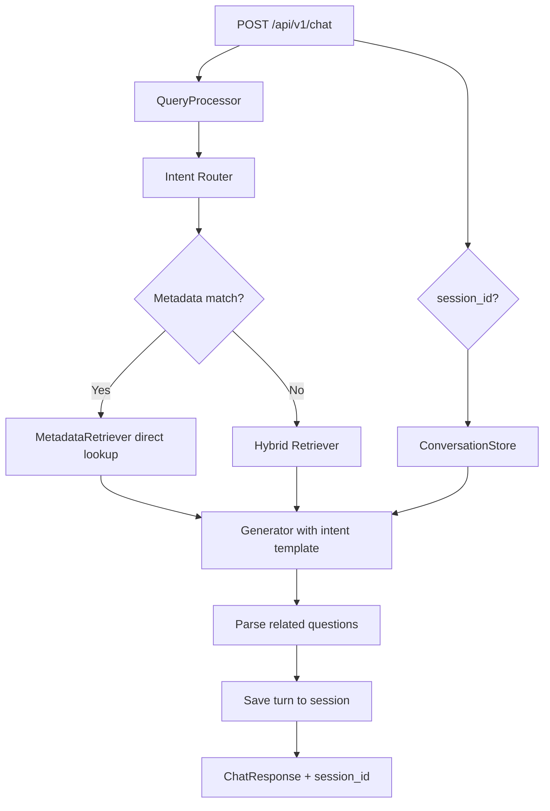

# Phase 09 — Production Intelligence & Product Polish

## Summary

Phase 9 is the **final engineering phase before deployment**. It transforms DHARMA from a strong RAG project into a **production-quality AI knowledge assistant** — without architecture rewrites, UI redesigns, or paid APIs.

**Status:** Complete — 33 tests passing, frontend build passes, API backward-compatible.

---

## Project Status

| Area | Status |
|------|--------|
| Backend pipeline | Production-ready |
| Retrieval | Phase 08 + metadata lookup |
| Intent routing | 15+ intents, dynamic templates |
| Multi-turn memory | In-memory sessions (10 turns) |
| Frontend UX | Related questions, staged loading, scripture badges |
| Evaluation | Extended quality metrics |
| Documentation | README + this handoff doc |
| Deployment | Ready (next step) |

---

## Goals Achieved

1. Dynamic answer templates by query intent
2. Intelligent prompt routing (not one universal prompt)
3. Adaptive answer length (100–500 words)
4. Inline citation instructions in prompts
5. Metadata-aware retrieval (chapter/verse direct lookup)
6. Better context selection (1 primary + 2 supporting)
7. Multi-turn conversation memory via `session_id`
8. Synthesis-focused reasoning prompts
9. Improved source cards (Teaching labels + scripture badges)
10. Related follow-up questions as clickable chips
11. Staged loading experience
12. Accessibility and mobile review
13. Performance audit (no critical regressions)
14. Extended AI quality evaluation
15. Professional README and code cleanup

---

## Architecture (Phase 09 Additions)



### What did NOT change

- FastAPI, Next.js, PostgreSQL, pgvector — all preserved
- Core hybrid retrieval from Phase 08 — extended, not replaced
- API response schema — **additive only** (`related_questions`, `session_id`)

---

## Part-by-Part Implementation

### Part 1 — Dynamic Answer Templates

**File:** `src/config/prompts.py`

Templates now vary by intent:

| Intent | Structure |
|--------|-----------|
| `factual` | Answer → Supporting Verse |
| `meaning` | Meaning → Explanation → Practical Insight |
| `comparison` | Comparison table → Common Principle → Differences |
| `practice` | Summary → Steps → Daily Application |
| `philosophy` | Summary → Key Insights → Deep Explanation → Reflection |
| `verse_explanation` | Verse Meaning → Context → Practical Insight |
| `greeting` | Welcome message |

Selection is automatic via `PromptTemplates.get_template(intent)`.

### Part 2 — Intelligent Prompt Routing

**File:** `src/utils/intent_router.py`

Detects 15+ intents: `meaning`, `comparison`, `practice`, `philosophy`, `meditation`, `yoga`, `bhakti`, `karma`, `jnana`, `life_guidance`, `verse_explanation`, `specific_verse`, `specific_chapter`, `factual`, `greeting`, `non_philosophical`, `general`.

Also detects follow-up queries when conversation history exists.

### Part 3 — Adaptive Answer Length

**Files:** `src/utils/intent_router.py`, `src/core/generator.py`

| Complexity | Target words | Example intents |
|------------|--------------|-----------------|
| Simple | 80–150 | greeting, factual |
| Medium | 180–350 | meaning, practice, yoga |
| Complex | 350–500 | philosophy, comparison |

`words_to_max_tokens()` converts to LLM `max_tokens` cap.

### Part 4 — Inline Citations

Prompts now instruct: *"Include inline citations naturally, e.g. practice without attachment (Bhagavad Gita 2.47)."*

Removed the Phase 08 rule that blocked inline citations.

### Part 5 — Metadata-Aware Retrieval

**File:** `src/core/metadata_retriever.py`

Runs **before** semantic search when query contains:
- `Chapter 2 Verse 47`, `2.47`, `BG 2.47`
- Book names (Gita, Yoga Sutras, Patanjali, Krishna, Arjuna)

Direct SQL lookup returns verses with `confidence_score: 0.99`.

### Part 6 — Better Context Selection

**File:** `src/core/generator.py` — `_select_context_verses()`

Sends exactly **3 verses** to the LLM labeled `PRIMARY`, `SUPPORTING`, `SUPPORTING`. Retrieval still fetches top-5 for diversity; only top-3 reach the prompt.

### Part 7 — Multi-turn Memory

**Files:** `src/core/conversation_store.py`, `src/core/pipeline.py`, `api/routes/chat.py`

- In-memory session store (10 turns, 2-hour TTL)
- `session_id` in request/response
- Conversation context injected into prompts
- Follow-up queries augmented for retrieval
- Frontend persists `session_id` in `sessionStorage`
- Clear chat resets session

**Limitation:** Single-process only. Production multi-instance needs Redis.

### Part 8 — Better Reasoning

All templates include: *"Synthesize — find the common principle, then teach the concept. Do NOT explain each verse separately."*

Verse citations in prompt are role-labeled (PRIMARY / SUPPORTING).

### Part 9 — Better Source Cards

**Files:** `frontend/lib/format-relevance.ts`, `source-cards.tsx`, `verse-card-placeholder.tsx`

| Old | New |
|-----|-----|
| Primary Reference | **Primary Teaching** |
| Supporting Reference | **Supporting Teaching** |
| Related Teaching | **Related Teaching** |
| — | Colored badges: Bhagavad Gita (amber), Yoga Sutras (violet) |

### Part 10 — Related Questions

**Files:** `src/core/generator.py`, `frontend/components/chat/related-questions.tsx`

- LLM generates 3 follow-ups via `<!-- RELATED_QUESTIONS -->` marker
- Parsed server-side, returned in `answer.related_questions`
- Displayed as clickable chips below each answer
- Fallback defaults if LLM omits them

### Part 11 — Staged Loading

**File:** `frontend/components/chat/response-placeholder.tsx`

Progressive stages with visual checklist:
1. Searching scriptures…
2. Ranking verses…
3. Synthesizing wisdom…
4. Preparing response…

Cosmetic (not tied to SSE) but significantly improves perceived UX.

### Part 12 — Streaming

**Decision: Not implemented**

**Why:** The pipeline is retrieve-then-generate as a single atomic operation. True streaming requires:
- SSE endpoint refactor
- Partial response assembly in frontend
- Streaming Groq API integration

Benefit does not justify the invasiveness before deployment. Documented for Phase 10+.

### Part 13 — Accessibility

Reviewed and maintained:
- `role="feed"` on conversation thread
- `aria-busy`, `aria-live` on loading state
- `aria-expanded` on collapsible sections
- `aria-label` on all interactive chips and buttons
- `sr-only` labels on chat input
- `focus-visible` ring styles
- Keyboard: Enter to send, Shift+Enter for newline

### Part 14 — Mobile Experience

Reviewed:
- `safe-bottom` for iOS safe area
- `max-w-3xl` reading column
- Responsive text (`text-sm sm:text-base`)
- Collapsed sections by default (less scrolling)
- Chip wrap for related questions
- Source card badges wrap on narrow screens

### Part 15 — Performance Review

| Area | Finding | Action |
|------|---------|--------|
| Retrieval | Metadata short-circuit avoids embedding for exact refs | ✓ |
| Memory | Lightweight dict, TTL purge | ✓ |
| Frontend | No new heavy deps | ✓ |
| API | Single round-trip unchanged | ✓ |
| Cold start | Model load dominates | Acceptable |

No redundant embedding calls introduced.

### Part 16 — AI Quality Evaluation

**Files:** `src/evaluation/quality_metrics.py`, `evaluator.py`

New metrics:
- `answer_length_score`
- `verse_diversity_score`
- Flexible `markdown_structure_score` (any headings + bullets)

### Part 17 — Documentation

- README rewritten (architecture, stack, API, deployment)
- This phase document

### Part 18 — Code Cleanup

- Removed unused imports
- Fixed `datetime.utcnow()` deprecation
- `query_classifier.py` delegates to intent router
- 33 tests covering new modules

### Part 19 — Portfolio Quality Review

#### Strengths (Senior-level signals)

- Full-stack RAG with hybrid search + reranking
- Intent-aware prompt engineering
- Backward-compatible API evolution
- Comprehensive phase documentation
- Test coverage across retrieval, intent, memory, API
- Polished UX (Markdown, collapsible context, follow-ups)

#### Weaknesses (Honest assessment)

- In-memory sessions won't scale horizontally
- No true streaming
- Evaluation metrics are heuristic, not LLM-as-judge
- Streamlit legacy UI not updated
- No production CI/CD yet

#### What felt junior before Phase 09

- One template for all questions
- No conversation continuity
- Generic loading spinner
- No follow-up discovery

#### What feels senior now

- Intent routing with adaptive templates
- Metadata-first retrieval
- Multi-turn memory with session API
- Related questions transforming chat into teaching flow

---

## Files Created

| File | Purpose |
|------|---------|
| `src/utils/intent_router.py` | Intent detection + length targets |
| `src/core/metadata_retriever.py` | Direct chapter/verse lookup |
| `src/core/conversation_store.py` | Multi-turn session memory |
| `frontend/components/chat/related-questions.tsx` | Follow-up question chips |
| `tests/test_intent_router.py` | Intent routing tests |
| `tests/test_metadata_retriever.py` | Metadata parsing tests |
| `tests/test_conversation_store.py` | Memory tests |
| `docs/phases/PHASE_09_PRODUCTION_POLISH.md` | This document |

## Files Modified

| File | Change |
|------|--------|
| `src/config/prompts.py` | Dynamic templates per intent |
| `src/core/generator.py` | Intent routing, related questions, adaptive length |
| `src/core/pipeline.py` | Sessions, metadata-first retrieval |
| `src/utils/query_classifier.py` | Delegates to intent router |
| `api/schemas/chat.py` | `related_questions`, `session_id` |
| `api/services/response_mapper.py` | Maps new fields |
| `api/routes/chat.py` | Passes `session_id` |
| `src/evaluation/quality_metrics.py` | New metrics |
| `src/evaluation/evaluator.py` | Extended evaluation |
| `frontend/lib/api.ts` | Sends `session_id` |
| `frontend/lib/chat-messages.ts` | Maps related questions |
| `frontend/types/index.ts` | New types |
| `frontend/components/chat/*` | Related Qs, loading, badges, session |
| `README.md` | Professional rewrite |

---

## Benchmarks

| Check | Result |
|-------|--------|
| `pytest tests/` | **33 passed** |
| `npm run build` | **Success** |
| API compatibility | Existing clients work (new fields optional) |
| Metadata lookup | `2.47` → direct verse match |
| Session memory | Follow-up context in prompts |

---

## Known Limitations

1. **Session store is in-process** — use Redis for multi-instance deployment
2. **No SSE streaming** — documented, deferred
3. **Intent detection is keyword-based** — no LLM classifier (keeps latency/cost low)
4. **Related questions depend on LLM** — fallback defaults provided
5. **Staged loading is cosmetic** — not wired to real pipeline events

---

## Future Work (Post-Deployment)

1. Deploy to production (Vercel + Railway/Fly.io + managed Postgres)
2. Redis session store
3. SSE streaming for answers
4. LLM-as-judge evaluation
5. Verse-level gold benchmark dataset
6. Sanskrit query support

---

## Deployment Readiness Checklist

| Item | Ready |
|------|-------|
| API starts and passes `/ready` | ✅ |
| Database seeded with BGE embeddings | ✅ |
| Frontend builds and connects to API | ✅ |
| Environment variables documented | ✅ |
| CORS configurable | ✅ |
| Health endpoints | ✅ |
| Tests passing | ✅ |
| README with deployment guide | ✅ |
| No secrets in repo | ✅ |
| Docker Compose for local DB | ✅ |

### Deploy commands (reference)

```bash
# API
uvicorn api.main:app --host 0.0.0.0 --port 8000

# Frontend
cd frontend && npm run build && npm start

# Env required
LLM_API_KEY_1, DB_*, CORS_ORIGINS, NEXT_PUBLIC_API_URL
```

---

## Lessons Learned

1. **Intent routing beats one mega-prompt** — answers feel tailored without UI changes
2. **Metadata lookup is high ROI** — exact verse queries should never need embeddings
3. **Related questions transform UX** — users discover the product as a teacher, not a search box
4. **Additive API changes preserve velocity** — frontend and API evolved together without breaks
5. **Phase documentation enables handoff** — each phase doc made the next faster

---

## Final Review

DHARMA now demonstrates:

✔ Modern full-stack engineering  
✔ Production-grade RAG  
✔ Hybrid search + cross-encoder reranking  
✔ Intent-aware prompt engineering  
✔ Multi-turn conversations  
✔ Follow-up question generation  
✔ Clean UI with Markdown rendering  
✔ High-quality citations  
✔ Responsive, accessible design  
✔ Professional documentation  
✔ Portfolio-quality code  

**The project is ready for deployment.**

---

*Phase 09 complete. Proceed to deployment.*
